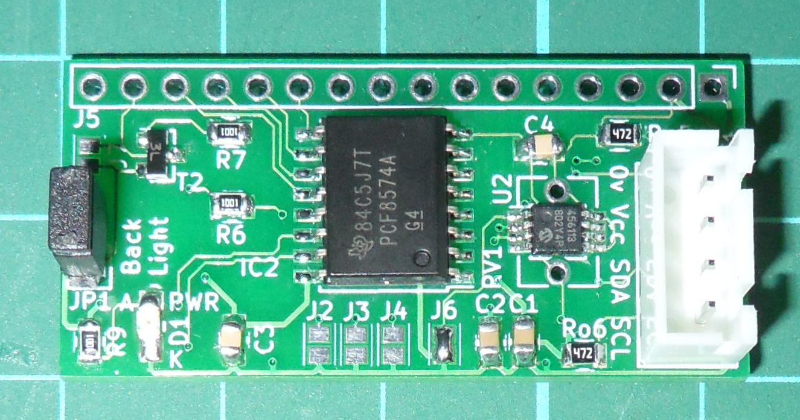
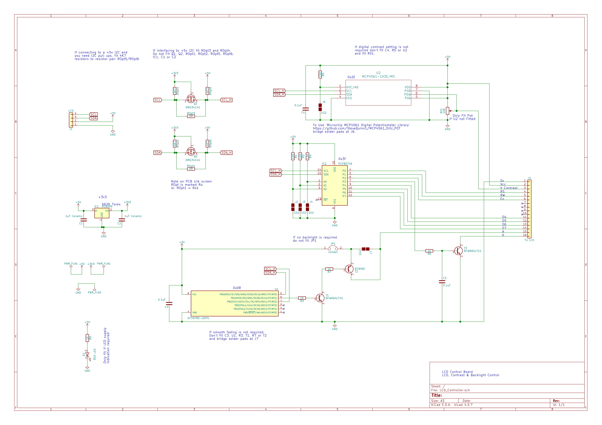

# I2C-LCD-Controller-Module

## I2C LCD Controller Module PCB and test code for Arduino

This repository details how to create a PCF8574A based I2C LCD controller module PCB, ascociated libraries and test code.

The module solders directly on to the back of an HD44780 LCD and differs from the generic I2C LCD Module by allowing the user to programmatically control the LCD Display, Contrast and Brightness. 
Brightness is controlled by a seperate on-board microcontroller via an ATTiny85 which PWM modulates the LCD backlight using a Quartic easing function to gradually attain the commanded value. 

The PCB has been designed to allow the user to select either;

 - Digital contrast control or subtitute with an analog pot,

 - PWM easing function controlled back lighting or straight on/off switching.

 - 3v3 or 5v I2C operation

For further details see the following instructable;

https://www.instructables.com/id/

### I2C LCD Controller Module PCB

### I2C LCD Controller Module PCB Fitted to 4 by 20 LCD

### Full circuit diagram

### Directory content

#### LCDControllerModule

This contains an example Arduino sketch allowing the user to exercise full control of the I2C module via issuing commands over a serial link.

To create and use the I2C LCD controller module you will require the following;

##### Arduino Sketch Libraries
LCD Library [here](https://github.com/SteveQuinn1/LiquidCrystal_I2C_PCF8574/)

Digital Pot Library [here](https://github.com/SteveQuinn1/MCP4561_DIGI_POT/)

##### PCB ATTiny85 Source (U1)
See Instructable [Smooth PWM LED Fading With the ATTiny85](https://www.instructables.com/id/Smooth-PWM-LED-Fading-With-the-ATTiny85/)

You will require 'Tiny85_I2C_Slave_PWM_2.ino' [here](https://cdn.instructables.com/ORIG/FBR/FVZ9/IXLAN8OF/FBRFVZ9IXLAN8OF.zip)

#### PCB

This contains a zipped copy of the Kicad 4.0.7 source files, BoM, Plots, footprints etc. So you can have your own PCBs manufactured.

#### docs

This contains the images on the front page of the repository.

